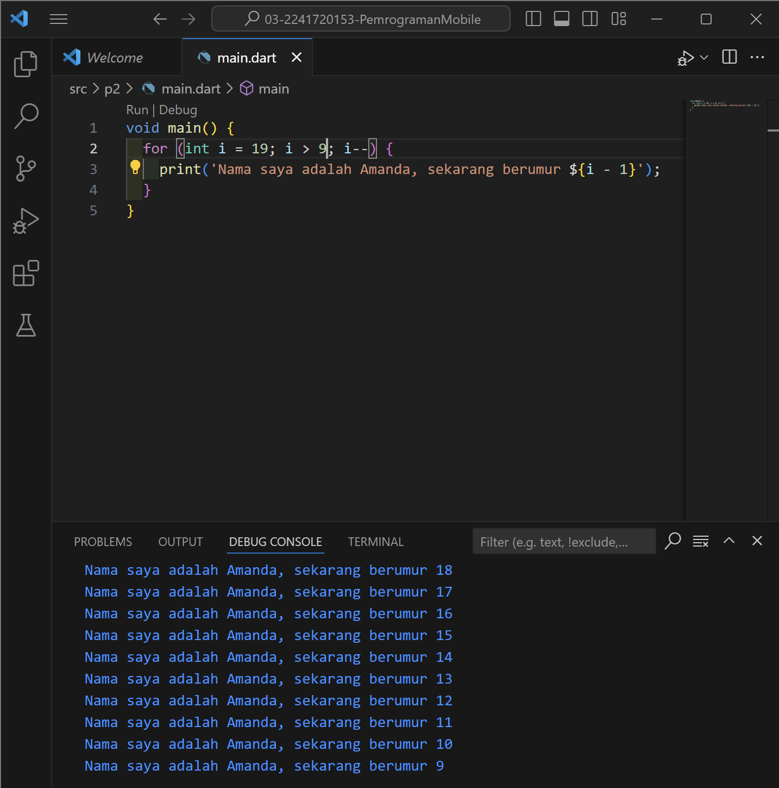

# Pemrograman Mobile - Pertemuan 2

Pengantar Bahasa Pemrograman Dart - Bagian 1

NIM : 2241720153

NAMA : Amanda Vanika Putri

**SOAL 1**

Modifikasilah kode pada baris 3 di VS Code atau Editor Code favorit Anda berikut ini agar mendapatkan keluaran (output) sesuai yang diminta!

**SOAL 2**

Mengapa sangat penting untuk memahami bahasa pemrograman Dart sebelum kita menggunakan framework Flutter ? Jelaskan!

- Karena bahasa Dart adalah inti dari framework Flutter. Semua pengembangan framework Flutter melibatkan pengetahuan/fitur mendalam dengan bahasa Dart; Kode aplikasi, kode plugin, dan manajemen dependensi semuanya menggunakan bahasa Dart beserta fitur-fiturnya. Memiliki pemahaman dasar yang kuat tentang Dart akan memudahkan untuk menjadi lebih produktif dengan Flutter dan nyaman dalam pengembangan Flutter

**SOAL 3**

Rangkumlah materi dari codelab ini menjadi poin-poin penting yang dapat Anda gunakan untuk membantu proses pengembangan aplikasi mobile menggunakan framework Flutter.

- **Dasar**

    Bahasa Dart merupakan dasar untuk bekerja dengan Flutter
    
- **Kelebihan**

    - Productive tooling, untuk menganalisis kode, plugin IDE, dan ekosistem paket yang besar.
    - Garbage collection,  untuk mengelola atau menangani dealokasi memori.
    - Type annotations,  untuk keamanan dan konsistensi dalam mengontrol semua data dalam aplikasi.
    - Statically typed, untuk menemukan bug selama kompilasi kode.
    - Portability,  dapat dikompilasi secara native ke kode Advanced RISC Machines (ARM) dan x86.

- **Sejarah**
   
    Diluncurkan pada tahun 2011, Dart telah berkembang sejak saat itu. Dart merilis versi stabilnya pada tahun 2013, dengan perubahan besar termasuk dalam rilis Dart 2.0 menjelang akhir 2018

- **Cara Kerja**

    Kode Dart dapat dieksekusi pada lingkungan yang mendukung bahasa Dart. Lingkungan yang mendukung bahasa Dart perlu memperhatikan fitur-fitur penting seperti berikut:

    - Runtime systems
    - Dart core libraries
    - Garbage collectors

    Eksekusi kode Dart dapat beroperasi dalam dua mode
    - Just-In-Time (JIT), tempat kode sumber dikompilasi sesuai kebutuhan
    - Ahead-Of-Time (AOT), VM bekerja lebih seperti sistem runtime Dart, yang menyediakan garbage collector dan metode-metode native dari Dart software development kit (SDK) pada aplikasi

- **Struktur**

    - Object orientation

        Dart dirancang untuk object-oriented (OO).
        
    - Dart operators

        Di Dart, operator tidak lebih dari method yang didefinisikan dalam class dengan sintaks khusus.

    - Arithmetic operators

        '+' untuk tambahan.
        '-' untuk pengurangan.
        '*' untuk perkalian.
        '/' untuk pembagian.
        '~/' untuk pembagian bilangan bulat. 
        '%' untuk operasi modulus (sisa bagi dari bilangan bulat).
        '-expression' untuk negasi (yang membalikkan suatu nilai).

    - Increment and decrement operators

        ++var atau var++ untuk menambah nilai variabel var sebesar 1

        --var atau var-- untuk mengurangi nilai variabel var sebesar 1
    - Equality and relational operators

        '==' untuk memeriksa apakah operan sama

        '!=' untuk memeriksa apakah operan berbeda

        '>' memeriksa apakah operan kiri lebih besar dari operan kanan

        '<' memeriksa apakah operan kiri lebih kecil dari operan kanan

        '>=' memeriksa apakah operan kiri lebih besar dari atau sama dengan operan kanan

        '<=' memeriksa apakah operan kiri kurang dari atau sama dengan operan kanan

    - Logical operators
    
        !expression negasi atau kebalikan hasil ekspresi—yaitu, true menjadi false dan false menjadi true.

        || menerapkan operasi logika OR antara dua ekspresi.

        && menerapkan operasi logika AND antara dua ekspresi.