# Pemrograman Mobile - Pertemuan 3

Pengantar Bahasa Pemrograman Dart - Bagian 2

NIM : 2241720153

NAMA : Amanda Vanika Putri

## Praktikum 1: Menerapkan Control Flows ("if/else")

**Langkah 1:**

Ketik atau salin kode program berikut ke dalam fungsi main().
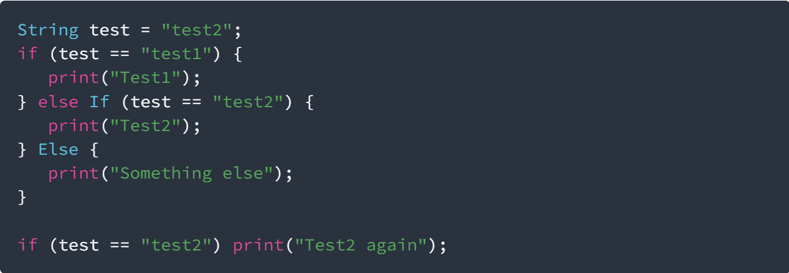

**Langkah 2:**

Silakan coba eksekusi (Run) kode pada langkah 1 tersebut. Apa yang terjadi? Jelaskan!
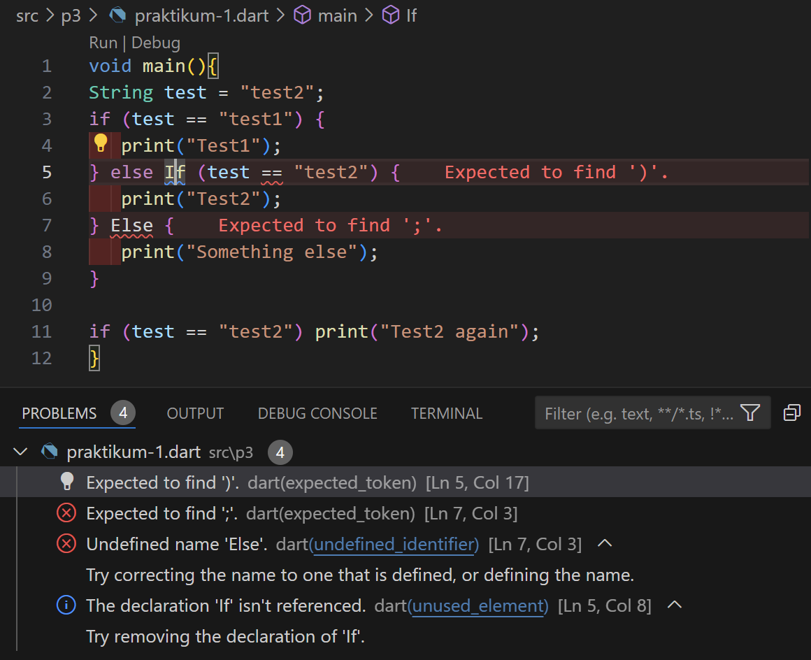
- Akan terjadi error dikarenakan terdapat kesalahan penulisan sintaks if dan else. Seharusnya tidak menggunakan huruf kapital. Berikut adalah hasil yang benar:
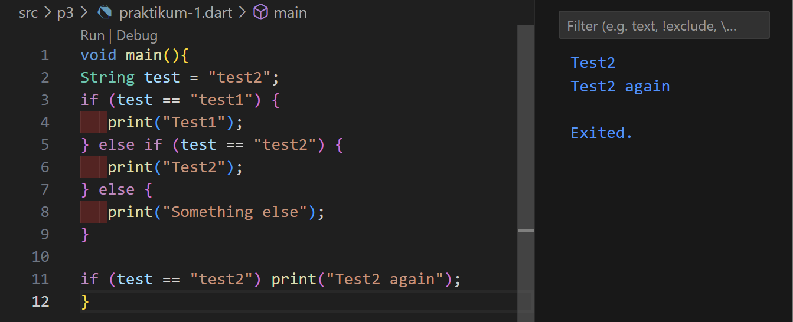

**Langkah 3:**

Tambahkan kode program berikut, lalu coba eksekusi (Run) kode Anda.
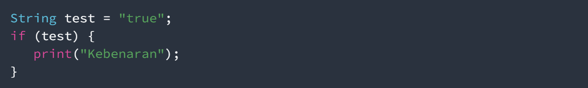

Apa yang terjadi? Jika terjadi error, silakan perbaiki namun tetap menggunakan if/else.
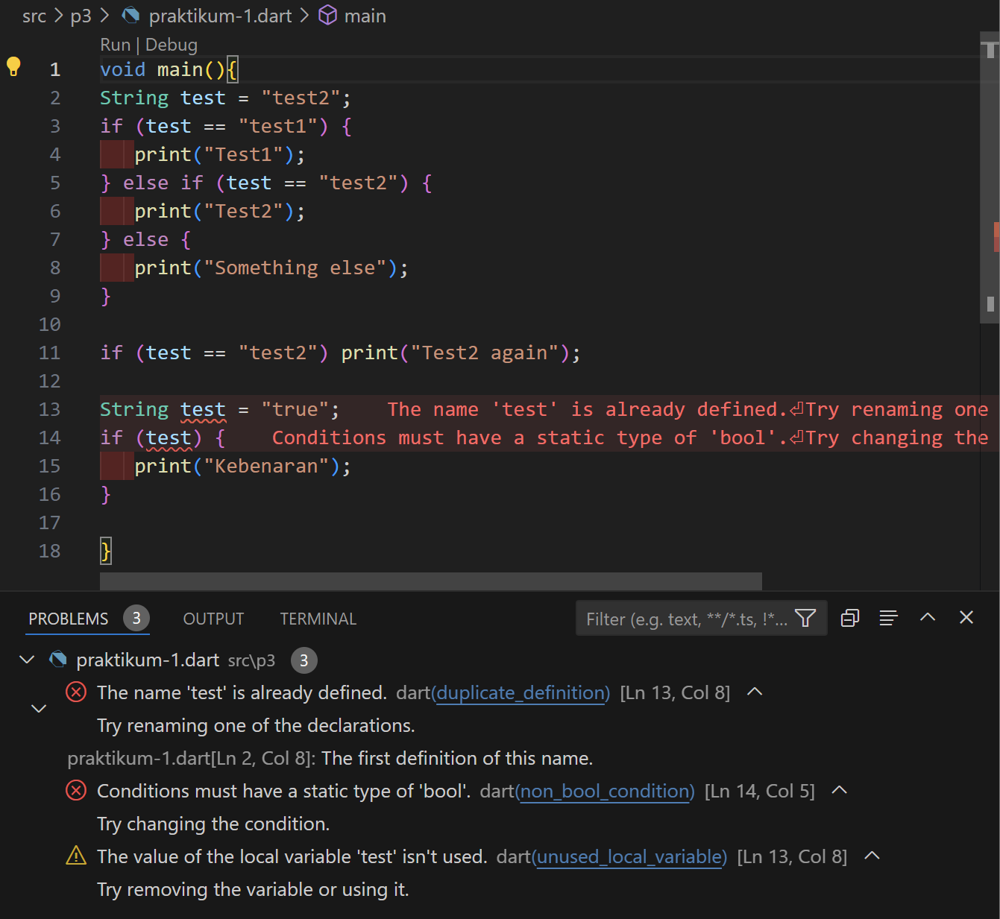

- Akan terjadi error pada baris ke 13 dikarenakan deklarasi variabel test yang berulang. Lalu pada baris ke 14 juga terjadi error dikarenakan variabel test bertipe String, tetapi kondisi if bertipe bool. Berikut adalah perbaikannya:
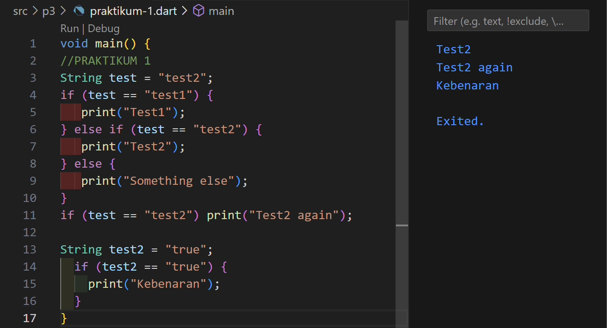

## Praktikum 2: Menerapkan Perulangan "while" dan "do-while"

**Langkah 1:**

Ketik atau salin kode program berikut ke dalam fungsi main().
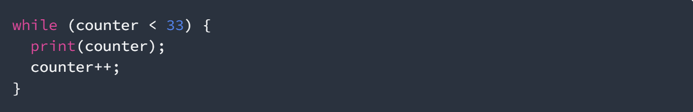

**Langkah 2:**

Silakan coba eksekusi (Run) kode pada langkah 1 tersebut. Apa yang terjadi? Jelaskan! Lalu perbaiki jika terjadi error.
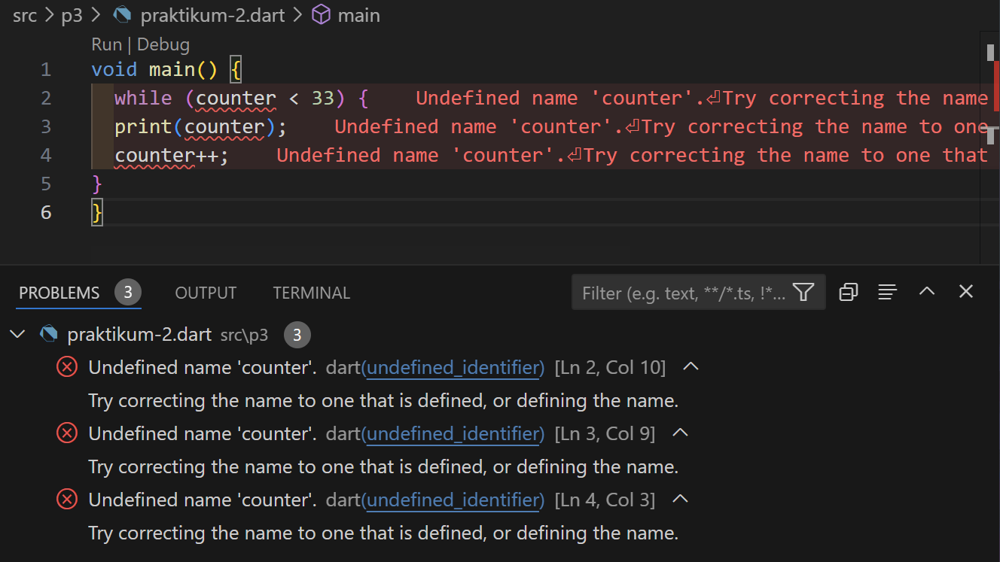

- Maka akan terjadi error dikarenakan variabel counter belum diinisialisai dan juga belum dideklarasikan. Berikut ini adalah perbaikannya:
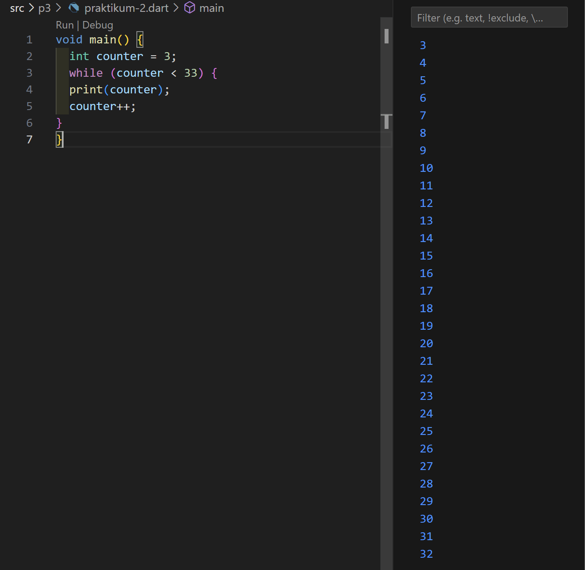

**Langkah 3**

Tambahkan kode program berikut, lalu coba eksekusi (Run) kode Anda.
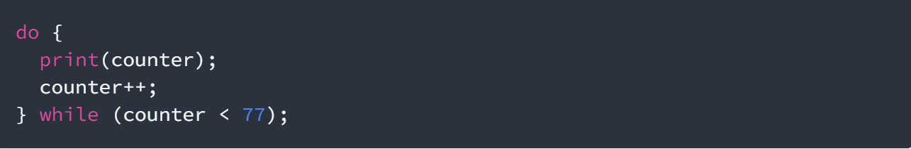

Apa yang terjadi? Jika terjadi error, silakan perbaiki namun tetap menggunakan do-while.
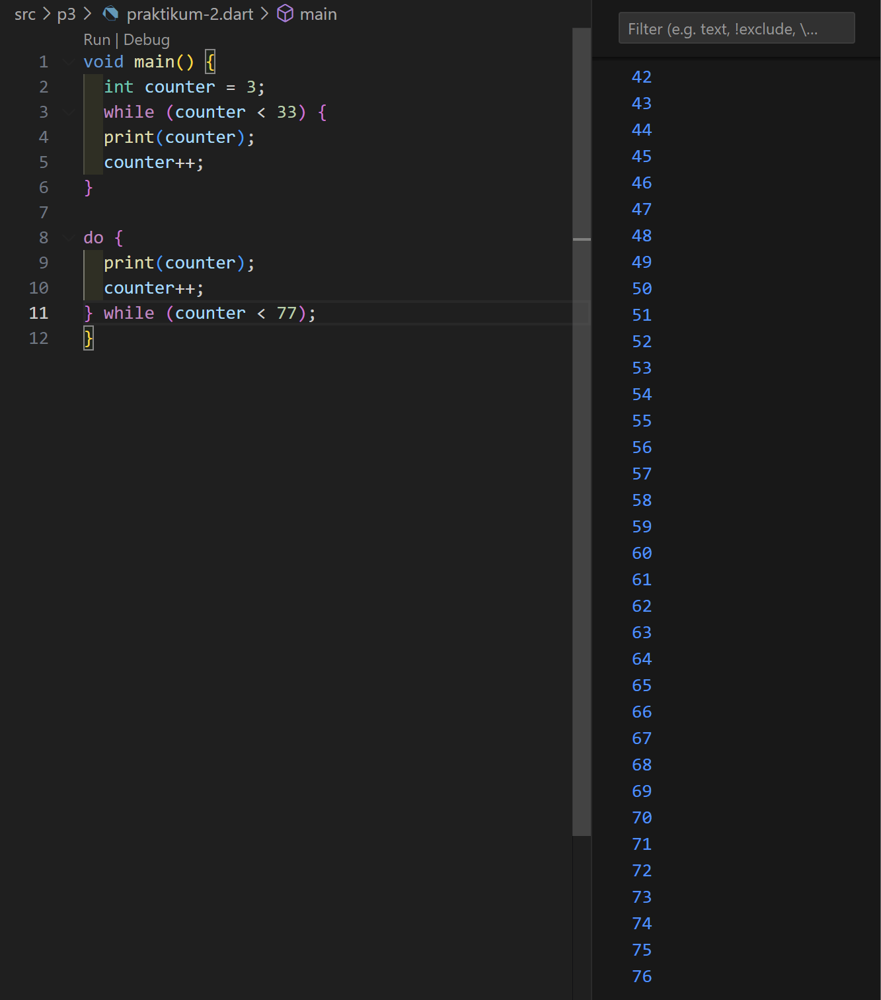

- Maka akan dapat dijalankan tanpa error. Output yang dihasilkan yaitu angka 3 hingga 76. 

## Praktikum 3: Menerapkan Perulangan "for" dan "break-continue"

**Langkah 1:**

Ketik atau salin kode program berikut ke dalam fungsi main().
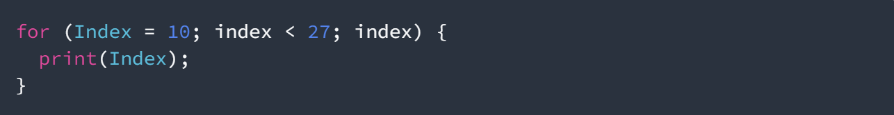

**Langkah 2:**

Silakan coba eksekusi (Run) kode pada langkah 1 tersebut. Apa yang terjadi? Jelaskan! Lalu perbaiki jika terjadi error.
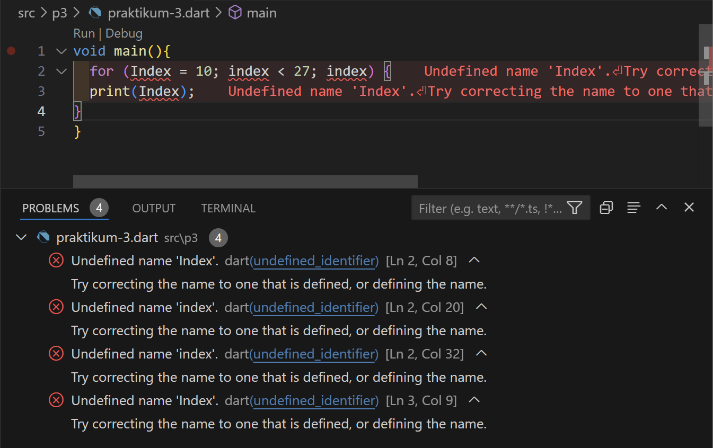

- Maka akan terjadi error dikarenakan variabel index belum dideklarasikan. Selain itu, penggunaan huruf kapital yang tidak konsisten pada 'index' juga menyebabkan error karena dart bersifat case-sensitive sehingga menganggap 'Index' dan 'index' adalah variabel yang berbeda. Lalu yang terakhir adalah tidak adanya penggunaan operator increement atau decreement untuk perubahan nilai. Berikut ini adalah perbaikannya:
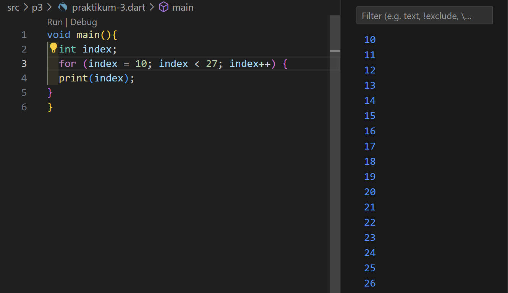

**Langkah 3**

Tambahkan kode program berikut di dalam for-loop, lalu coba eksekusi (Run) kode Anda.
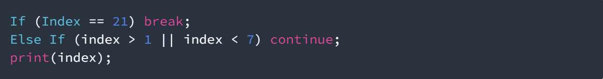

Apa yang terjadi? Jika terjadi error, silakan perbaiki namun tetap menggunakan for dan break-continue.
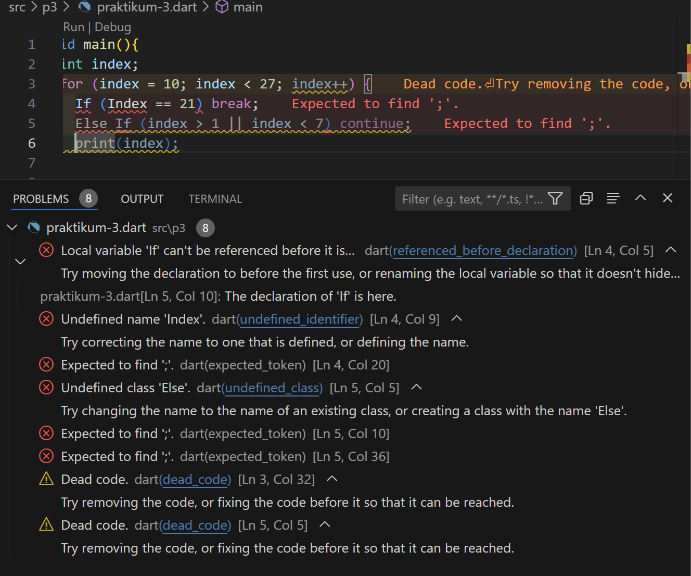

- Maka akan terjadi error dikarenakan terdapat penggunaan huruf kapital pada sintaks if dan else. Seperti yang telah disebutkan sebelumnya, dart bersifat case-sensitive sehingga penggunaan huruf kapital pada sintaks akan menghasilkan error. Berikut adalah perbaikannya:

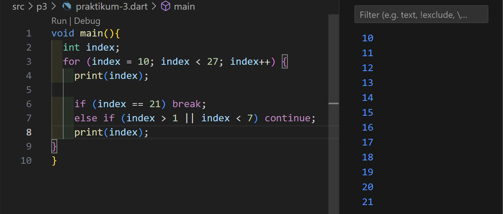

## Tugas Praktikum

Buatlah sebuah program yang dapat menampilkan bilangan prima dari angka 0 sampai 201 menggunakan Dart. Ketika bilangan prima ditemukan, maka tampilkan nama lengkap dan NIM Anda.
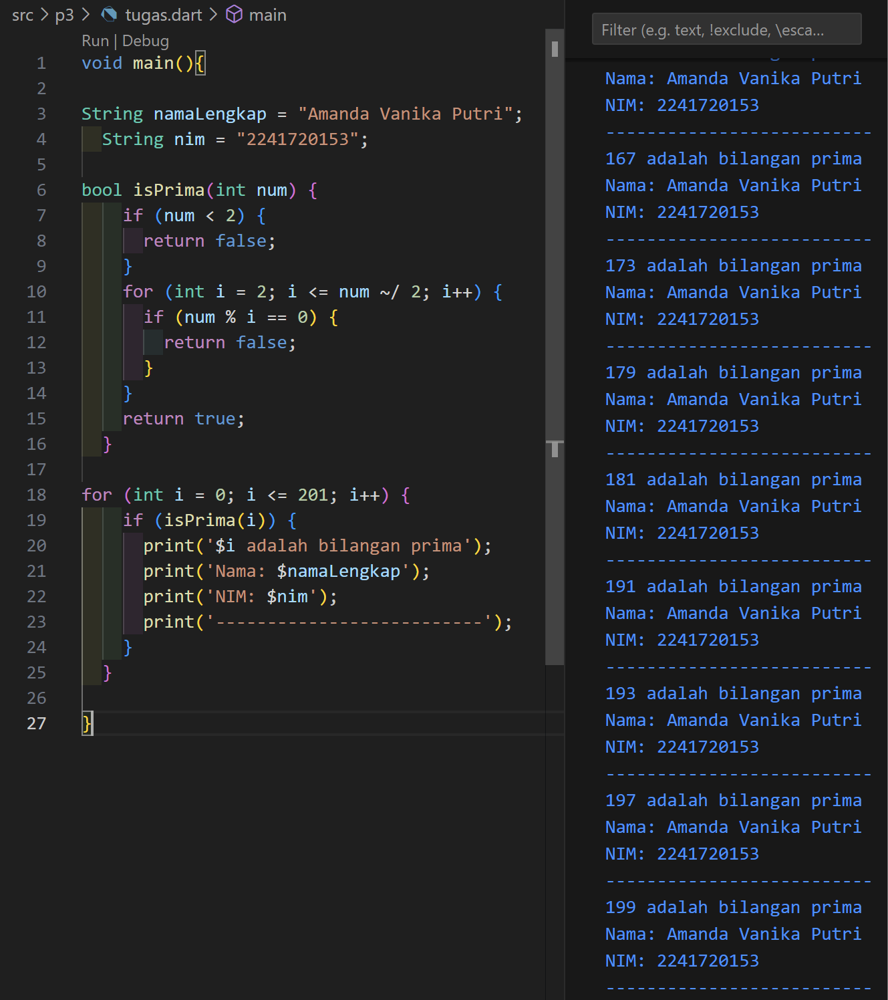
