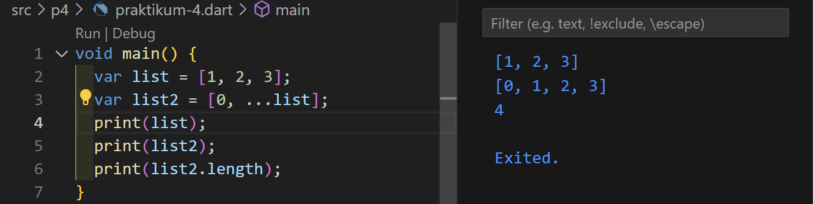

# Pemrograman Mobile - Pertemuan 4

Pengantar Bahasa Pemrograman Dart - Bagian 3

NIM : 2241720153

NAMA : Amanda Vanika Putri

## Praktikum 1: Eksperimen Tipe Data List

**Langkah 1:**

Ketik atau salin kode program berikut ke dalam void main().

**Langkah 2:**

Silakan coba eksekusi (Run) kode pada langkah 1 tersebut. Apa yang terjadi? Jelaskan!

- Akan memberikan output 3 2 1. var list digunakan untuk membuat sebuah list berisi angka [1, 2, 3]. assert(list.length) digunakan untuk memastikan panjang list. assert(list[i]) digunakan untuk memeriksa elemen pada indeks ke-i. 

**Langkah 3:**

Ubah kode pada langkah 1 menjadi variabel final yang mempunyai index = 5 dengan default value = null. Isilah nama dan NIM Anda pada elemen index ke-1 dan ke-2. Lalu print dan capture hasilnya.

Apa yang terjadi? Jika terjadi error, silakan perbaiki.
- Akan terjadi error. Berikut ini perbaikannya:

## Praktikum 2: Eksperimen Tipe Data Set

**Langkah 1:**

Ketik atau salin kode program berikut ke dalam fungsi main().

**Langkah 2:**

Silakan coba eksekusi (Run) kode pada langkah 1 tersebut. Apa yang terjadi? Jelaskan! Lalu perbaiki jika terjadi error.

- Maka kode akan dijalankan tanpa error dikarenakan variabel halogens telah diinisialisasikan dengan tanda petik sehingga dianggap sebagai nilai String.

**Langkah 3**

Tambahkan kode program berikut, lalu coba eksekusi (Run) kode Anda.

Apa yang terjadi ? Jika terjadi error, silakan perbaiki namun tetap menggunakan ketiga variabel tersebut. Tambahkan elemen nama dan NIM Anda pada kedua variabel Set tersebut dengan dua fungsi berbeda yaitu .add() dan .addAll(). Untuk variabel Map dihapus, nanti kita coba di praktikum selanjutnya.

- Maka hanya akan menampilkan list tanpa isi. Berikut adalah tampilan setelah diberi nama dan nim menggunakan fungsi add() dan addAll():

## Praktikum 3: Eksperimen Tipe Data Maps

**Langkah 1:**

Ketik atau salin kode program berikut ke dalam fungsi main().

**Langkah 2:**

Silakan coba eksekusi (Run) kode pada langkah 1 tersebut. Apa yang terjadi? Jelaskan! Lalu perbaiki jika terjadi error.

- Maka akan dijalankan tanpa error. Dibuat variabel gifts dan nobleGases yang merupakan sebuah map yaitu data yang menyimpan pasangan key-value.

**Langkah 3**

Tambahkan kode program berikut, lalu coba eksekusi (Run) kode Anda.

pa yang terjadi ? Jika terjadi error, silakan perbaiki

- Maka akan dijalankan tanpa error.

Tambahkan elemen nama dan NIM Anda pada tiap variabel di atas (gifts, nobleGases, mhs1, dan mhs2). Dokumentasikan hasilnya dan buat laporannya!

## Praktikum 4: Eksperimen Tipe Data List: Spread dan Control-flow Operators

**Langkah 1:**

Ketik atau salin kode program berikut ke dalam fungsi main().

**Langkah 2:**

Silakan coba eksekusi (Run) kode pada langkah 1 tersebut. Apa yang terjadi? Jelaskan! Lalu perbaiki jika terjadi error.

- Maka akan terjadi error. Hal ini dikarenakan tidak ada deklarasi variabel list1. Berikut adalah perbaikannya:

**Langkah 3**

Tambahkan kode program berikut, lalu coba eksekusi (Run) kode Anda.

apa yang terjadi? Jika terjadi error, silakan perbaiki

- Maka akan terjadi error. Sama seperti sebelumnya, hal ini dikarenakan variabel list1 tidak dideklarasikan. Berikut perbaikannya:

Tambahkan variabel list berisi NIM Anda menggunakan Spread Operators. Dokumentasikan hasilnya dan buat laporannya!

**Langkah 4**
Tambahkan kode program berikut, lalu coba eksekusi (Run) kode Anda.

Apa yang terjadi ? Jika terjadi error, silakan perbaiki. Tunjukkan hasilnya jika variabel promoActive ketika true dan false.

- Maka akan terjadi error dikarenakan 'promoActive' tidak diketahui. Berikut perbaikannya:

**Langkah 5**
Tambahkan kode program berikut, lalu coba eksekusi (Run) kode Anda.

Apa yang terjadi? Jika terjadi error, silakan perbaiki. Tunjukkan hasilnya jika variabel login mempunyai kondisi lain.

- Maka akan terjadi error dikarenakan 'login' tidak diketahui. Berikut perbaikannya:

**Langkah 6**
Tambahkan kode program berikut, lalu coba eksekusi (Run) kode Anda.

Apa yang terjadi ? Jika terjadi error, silakan perbaiki. Jelaskan manfaat Collection For dan dokumentasikan hasilnya.

- Maka akan dijalankan tanpa error. Pada listOfStrings berisi elemen dari #0 dan melakukan perulangan menyesuaikan dengan nilai listOfInts. Collection for di Dart adalah fitur yang memungkinkan untuk membuat dan menginisialisasi koleksi (seperti list, set, atau map) secara dinamis dan lebih efisien dengan menggunakan loop.

## Praktikum 5: Eksperimen Tipe Data Records

**Langkah 1:**

Ketik atau salin kode program berikut ke dalam fungsi main().

**Langkah 2:**

Silakan coba eksekusi (Run) kode pada langkah 1 tersebut. Apa yang terjadi? Jelaskan! Lalu perbaiki jika terjadi error.

- Maka akan terjadi error. Hal ini dikarenakan tidak ada tanda ; pada baris ke-3. Berikut adalah perbaikannya:

**Langkah 3**

Tambahkan kode program berikut di luar scope void main(), lalu coba eksekusi (Run) kode Anda.

Apa yang terjadi? Jika terjadi error, silakan perbaiki. Gunakan fungsi tukar() di dalam main() sehingga tampak jelas proses pertukaran value field di dalam Records.

- Maka akan dijalankan tanpa adanya error dikarenakan kode tersebut tidak dipanggil ke dalam fungsi main().

**Langkah 4**
Tambahkan kode program berikut di dalam scope void main(), lalu coba eksekusi (Run) kode Anda.

Apa yang terjadi ? Jika terjadi error, silakan perbaiki. Inisialisasi field nama dan NIM Anda pada variabel record mahasiswa di atas. Dokumentasikan hasilnya dan buat laporannya!

- Maka akan terjadi error dikarenakan variabel mahasiswa tidak dideklarasikan. Berikut perbaikannya:

**Langkah 5**
ambahkan kode program berikut di dalam scope void main(), lalu coba eksekusi (Run) kode Anda.

Apa yang terjadi? Jika terjadi error, silakan perbaiki. Gantilah salah satu isi record dengan nama dan NIM Anda, lalu dokumentasikan hasilnya dan buat laporannya!

- Maka akan dijalankan tanpa error karena nilai dari variabel mahasiswa2 menggunakan posisi field ($1) dan nama (a).
## Tugas Praktikum

1. Jelaskan yang dimaksud Functions dalam bahasa Dart!
- Function merupakan blok kode yang dirancang untuk melakukan tugas tertentu dan pada function dapat menerima parameter dan mengembalikan nilai. Contoh:

2. Jelaskan jenis-jenis parameter di Functions beserta contoh sintaksnya!
- Positional Parameters (Parameter Posisi)
Parameter yang harus diberikan nilai sesuai urutan. Jika sebuah fungsi memiliki beberapa parameter posisi, maka nilai-nilai harus dimasukkan sesuai dengan urutan yang telah ditetapkan. Contoh:

- Named Parameters (Parameter Bernama)
Parameter yang nilainya dapat diberikan tanpa memperhatikan urutan, dengan menyertakan nama parameter. Named parameters umumnya didefinisikan dalam tanda kurung kurawal {}. Contoh:

- Default Parameters (Parameter Default)
Parameter opsional yang memiliki nilai bawaan jika tidak diisi saat fungsi dipanggil. Parameter ini biasanya ditulis sebagai named parameter. Contoh:

- Required Parameters
Dalam versi terbaru Dart, Anda bisa menggunakan required pada named parameters untuk memastikan bahwa parameter tersebut harus diisi saat fungsi dipanggil. Contoh:

3. Jelaskan maksud Functions sebagai first-class objects beserta contoh sintaknya!
- First-class bisa saja berupa function atau variable yang dapat dioperasikan dengan cara yang sama seperti entitas lain. Contoh:

4. Apa itu Anonymous Functions? Jelaskan dan berikan contohnya!
- Anonymous Functions adalah fungsi yang tidak memiliki nama, sering digunakan sebagai argumen dalam fungsi lain atau sebagai callback. Fungsi ini memungkinkan penulisan kode yang lebih ringkas dan mudah dibaca. Contoh:

5. Jelaskan perbedaan Lexical scope dan Lexical closures! Berikan contohnya!
- Lexical scope adalah lingkup variabel yang ditentukan oleh posisi deklarasinya dalam kode. Variabel yang dideklarasikan dalam suatu fungsi hanya dapat diakses di dalam fungsi tersebut, tidak dapat diakses dari fungsi lain. Contoh:

- Lexical closure adalah fungsi yang dapat mengakses variabel dari lingkup luar, bahkan setelah fungsi tersebut dieksekusi. Closure "menutup" lingkup di mana mereka dideklarasikan. Contoh:

6. Jelaskan dengan contoh cara membuat return multiple value di Functions!
- Untuk mengembalikan beberapa nilai dari sebuah fungsi, kita bisa menggunakan List, Map, 

