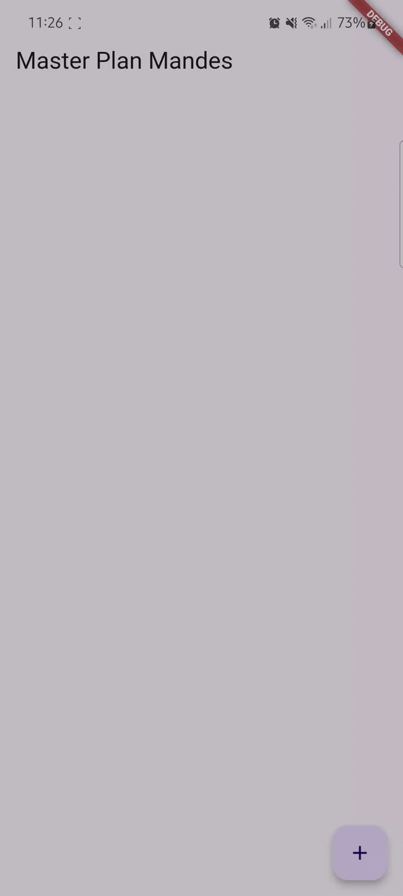
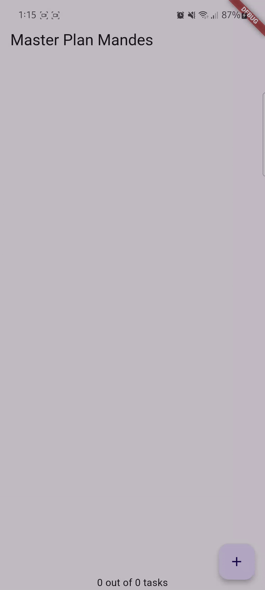
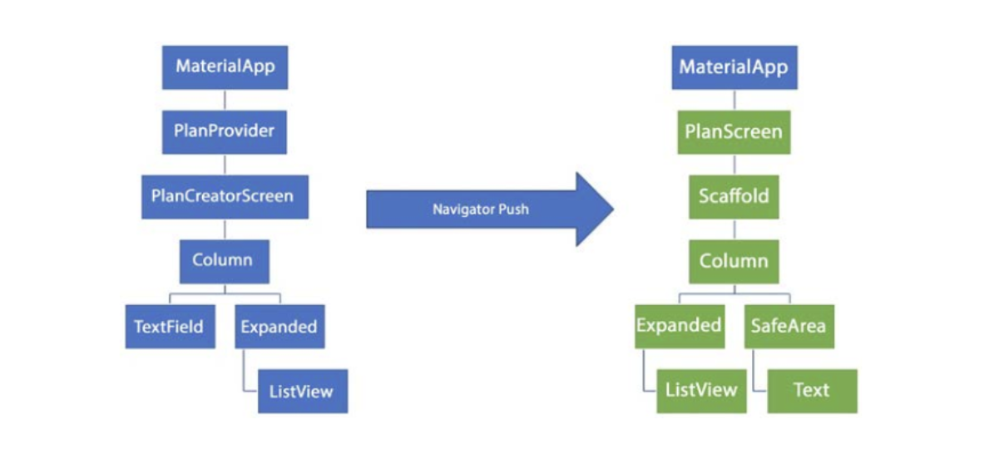

# Pemrograman Mobile - Pertemuan 10

Dasar State Management

NIM : 2241720153

NAMA : Amanda Vanika Putri

## Praktikum 1: Dasar State dengan Model-View

## Tugas Praktikum 1: Dasar State dengan Model-View
1. Selesaikan langkah-langkah praktikum tersebut, lalu dokumentasikan berupa GIF hasil akhir praktikum beserta penjelasannya di file README.md! Jika Anda menemukan ada yang error atau tidak berjalan dengan baik, silakan diperbaiki.

2. Jelaskan maksud dari langkah 4 pada praktikum tersebut! Mengapa dilakukan demikian?
    - Hal tersebut dilakukan untuk memudahkan import file plan.dart dan task.dart pada file lain (hanya membutuhkan satu perintah import).

3. Mengapa perlu variabel plan di langkah 6 pada praktikum tersebut? Mengapa dibuat konstanta ?
    - Karena variabel plan digunakan untuk menyimpan instance dari model Plan, yang merepresentasikan rencana atau daftar tugas dalam aplikasi. Variabel tersebut dibuat konstanta agar tetap dan tidak berubah setelah dibuat.

4. Lakukan capture hasil dari Langkah 9 berupa GIF, kemudian jelaskan apa yang telah Anda buat!

    - Akan dibuat aplikasi to-do list scrollable sederhana yang memungkinkan pengguna menambahkan tugas, menandai tugas yang telah selesai.

5. Apa kegunaan method pada Langkah 11 dan 13 dalam lifecyle state
    - method initState() digunakan untuk menginisialisasi objek state sebelum widget dibangun. Sedangkan method dispose() adalah metode yang dipanggil saat objek state dihapus dari widget tree, misalnya ketika widget dihapus dari tampilan atau widget induknya dihapus.

## Praktikum 2: Mengelola Data Layer dengan InheritedWidget dan InheritedNotifier

## Tugas Praktikum 2: InheritedWidget
1. Selesaikan langkah-langkah praktikum tersebut, lalu dokumentasikan berupa GIF hasil akhir praktikum beserta penjelasannya di file README.md! Jika Anda menemukan ada yang error atau tidak berjalan dengan baik, silakan diperbaiki sesuai dengan tujuan aplikasi tersebut dibuat.

2. Jelaskan mana yang dimaksud InheritedWidget pada langkah 1 tersebut! Mengapa yang digunakan InheritedNotifier?
    - Pada langkah 1, PlanProvider adalah kelas yang diturunkan dari InheritedNotifier<ValueNotifier<Plan>>. InheritedWidget digunakan untuk mempermudah widget-widget di bawahnya dalam mengambil data atau mendeteksi perubahan tanpa perlu menerima data tersebut secara eksplisit sebagai parameter. Dengan menggabungkan InheritedNotifier, PlanProvider memungkinkan data yang diteruskan untuk memicu pembaruan otomatis pada widget yang bergantung padanya saat terjadi perubahan data, sehingga aplikasi dapat tetap sinkron secara efisien.

3. Jelaskan maksud dari method di langkah 3 pada praktikum tersebut! Mengapa dilakukan demikian?
    - Method completedCount() pada kelas Plan digunakan untuk menghitung berapa banyak tugas yang telah diselesaikan. Sedangkan method completenessMessage() menghasilkan pesan yang menginformasikan progres penyelesaian tugas, dengan menampilkan jumlah tugas yang sudah selesai dibandingkan dengan total tugas yang ada. Kedua method ini membantu memberikan gambaran yang jelas tentang progress rencana pengguna. 

4. Lakukan capture hasil dari Langkah 9 berupa GIF, kemudian jelaskan apa yang telah Anda buat!

    - Pada praktikum ini pembuatan footer dengan count untuk melihat banyaknya task yang telah kita selesaikan. 

## Praktikum 3: Membuat State di Multiple Screens

## Tugas Praktikum 3: State di Multiple Screens

1. Selesaikan langkah-langkah praktikum tersebut, lalu dokumentasikan berupa GIF hasil akhir praktikum beserta penjelasannya di file README.md! Jika Anda menemukan ada yang error atau tidak berjalan dengan baik, silakan diperbaiki sesuai dengan tujuan aplikasi tersebut dibuat.

2. Berdasarkan Praktikum 3 yang telah Anda lakukan, jelaskan maksud dari gambar diagram berikut ini!

    - Diagram ini menunjukkan proses navigasi dalam aplikasi Flutter menggunakan Navigator.push untuk berpindah dari satu tampilan ke tampilan lain. Di sisi kiri, tampilan awal adalah PlanCreatorScreen, yang berisi TextField dan ListView di dalam sebuah Column. Ketika Navigator.push digunakan, aplikasi akan berpindah ke tampilan baru di sisi kanan, yaitu PlanScreen. Pada PlanScreen, ada tambahan komponen seperti Scaffold, SafeArea, dan Text, yang membantu membentuk struktur tata letak yang lebih lengkap. Scaffold menyediakan kerangka dasar untuk UI, sedangkan SafeArea memastikan bahwa konten tidak terhalang oleh area layar yang sensitif, seperti notch atau status bar.iagram ini menunjukkan proses navigasi dalam aplikasi Flutter menggunakan Navigator.push untuk berpindah dari satu tampilan ke tampilan lain. Di sisi kiri, tampilan awal adalah PlanCreatorScreen, yang berisi TextField dan ListView di dalam sebuah Column. Ketika Navigator.push digunakan, aplikasi akan berpindah ke tampilan baru di sisi kanan, yaitu PlanScreen. Pada PlanScreen, ada tambahan komponen seperti Scaffold, SafeArea, dan Text, yang membantu membentuk struktur tata letak yang lebih lengkap. Scaffold menyediakan kerangka dasar untuk UI, sedangkan SafeArea memastikan bahwa konten tidak terhalang oleh area layar yang sensitif, seperti notch atau status bar.

3. Lakukan capture hasil dari Langkah 14 berupa GIF, kemudian jelaskan apa yang telah Anda buat!

    - Akan membuat aplikasi lebih kompleks, dimana setiap kali membuat plan, akan terdapat tasK-task yang perlu diselesaikan terlebih dahulu. Selain itu juga dapat menambahkan lebih dari satu plan.