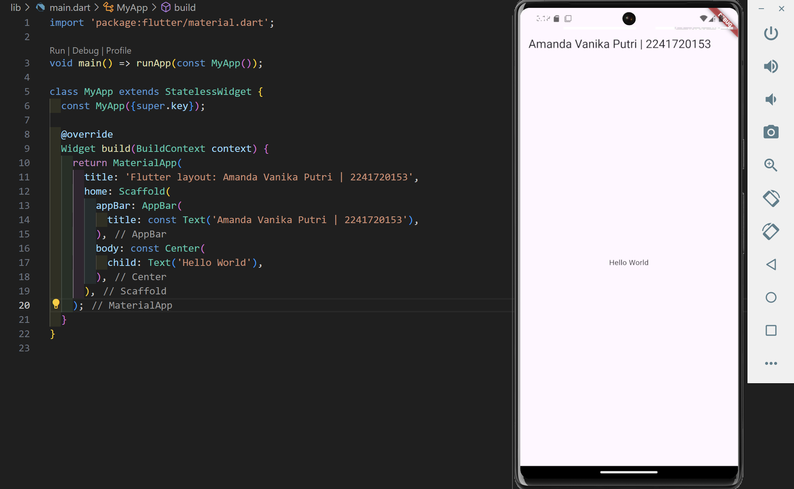
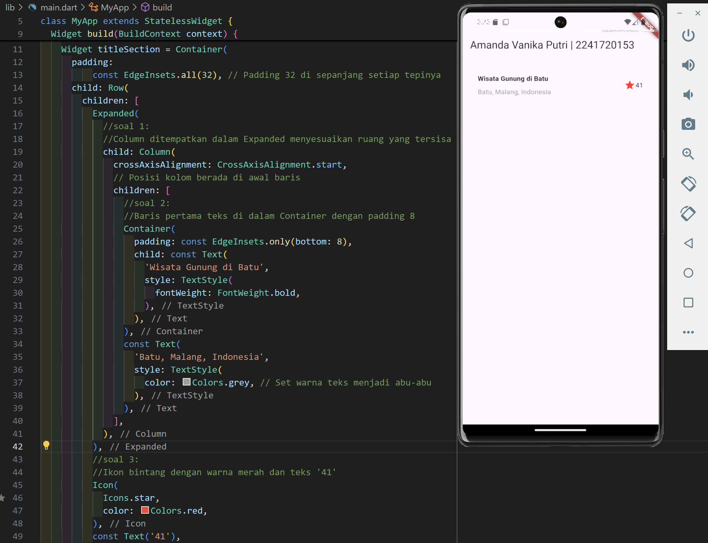
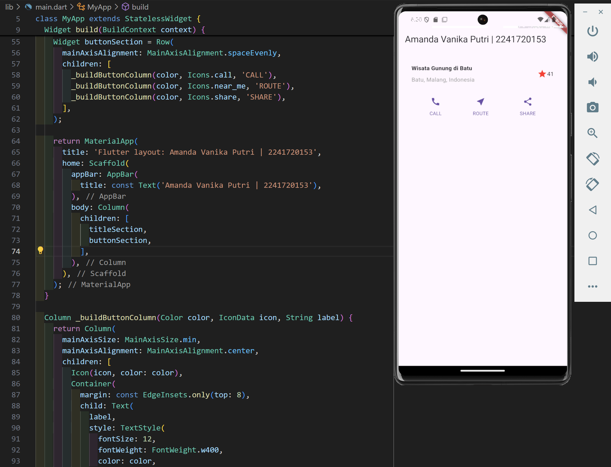
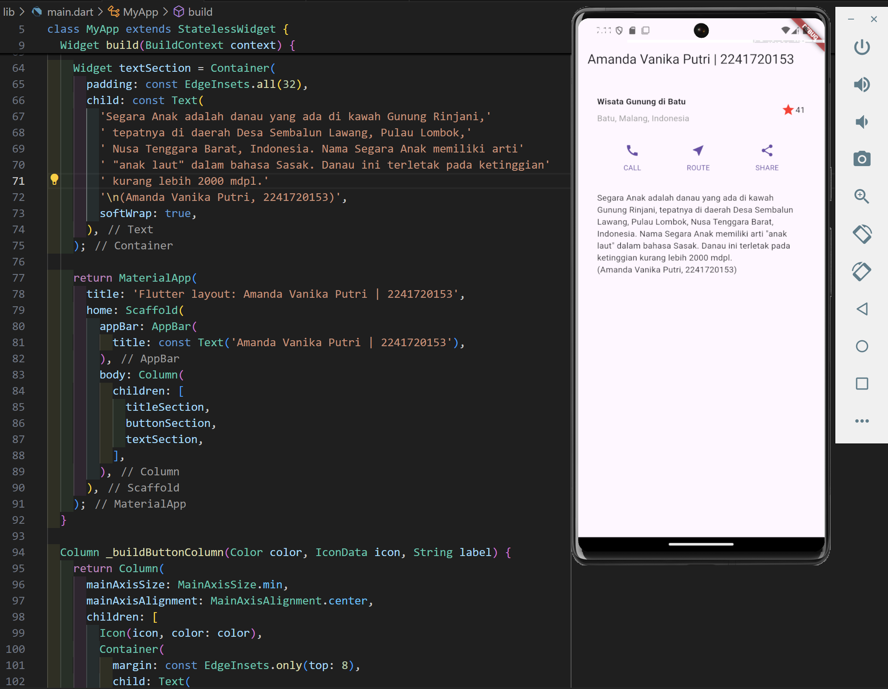
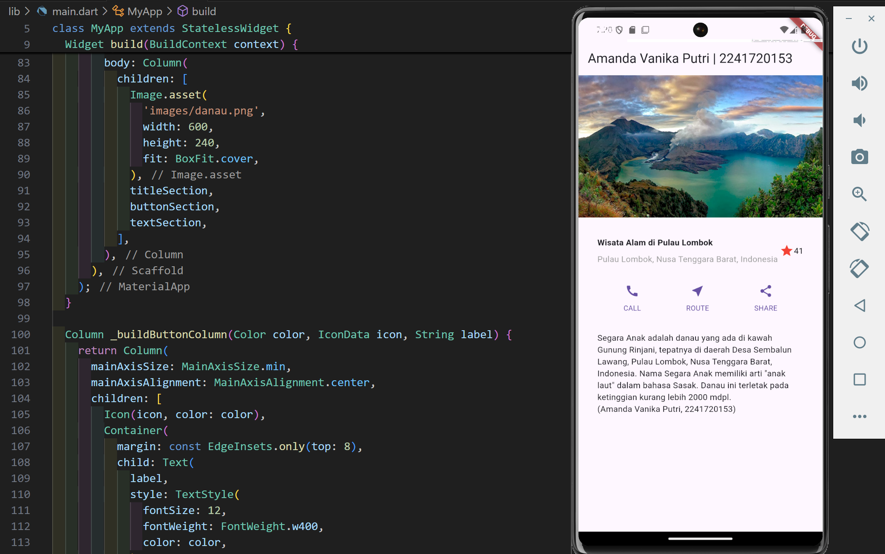
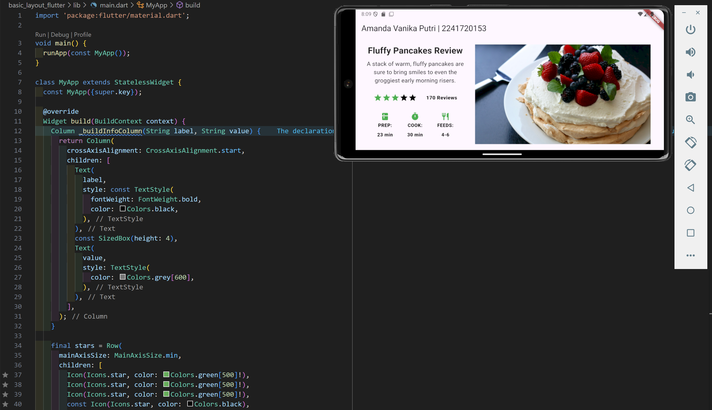
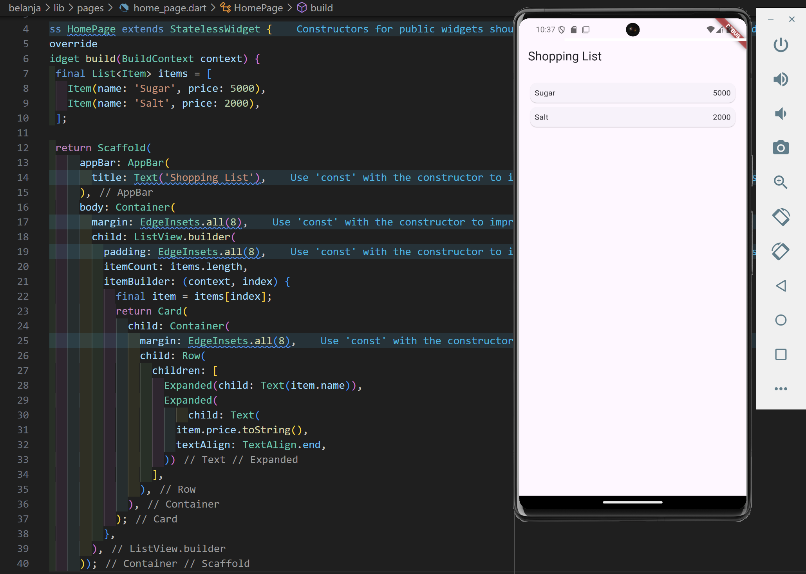
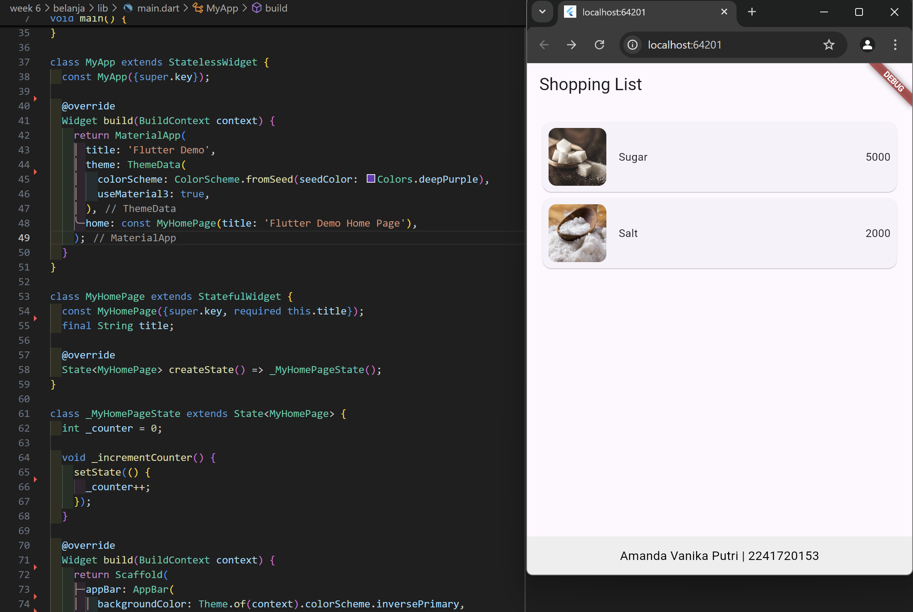
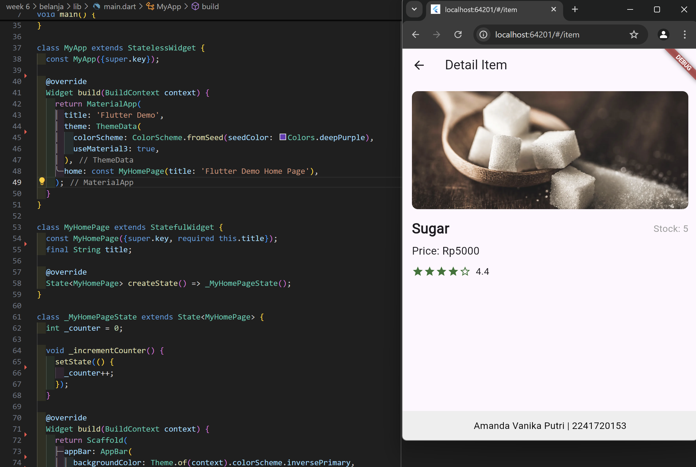
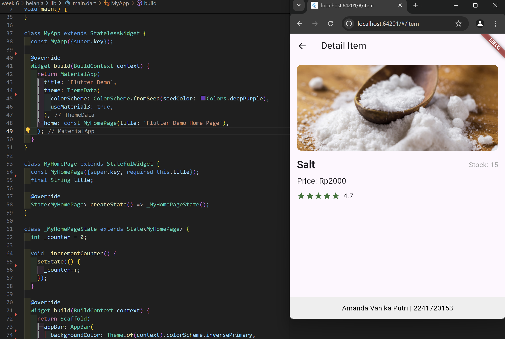

# Pemrograman Mobile - Pertemuan 6

Layout dan Navigasi

NIM : 2241720153

NAMA : Amanda Vanika Putri

## Praktikum 1: Membangun Layout di Flutter

## Praktikum 2: Implementasi Button Row

## Praktikum 3: Implementasi Text Section

## Praktikum 4: Implementasi Image Section

## Tugas Praktikum 1

## Praktikum 5: Membangun Navigasi di Flutter

## Tugas Praktikum 2

