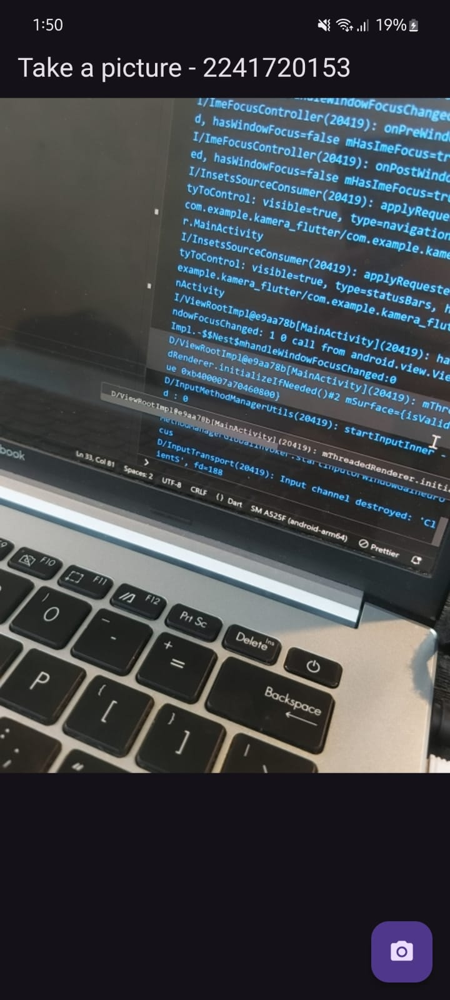

# Pemrograman Mobile - Pertemuan 9

Kamera

NIM : 2241720153

NAMA : Amanda Vanika Putri

## Praktikum 1: Mengambil Foto dengan Kamera di Flutter

- Akan dibuat sebuah fitur untuk mengambil gambar dan menampilkan hasilnya.

## Praktikum 2: Membuat Photo Filter Carousel

- Akan dibuat sebuah fitur untuk menambahkan filter pada gambar yang akan diambil.

## Tugas Praktikum
1. Selesaikan Praktikum 1 dan 2, lalu dokumentasikan dan push ke repository Anda berupa screenshot setiap hasil pekerjaan beserta penjelasannya di file README.md! Jika terdapat error atau kode yang tidak dapat berjalan, silakan Anda perbaiki sesuai tujuan aplikasi dibuat!

2. Gabungkan hasil praktikum 1 dengan hasil praktikum 2 sehingga setelah melakukan pengambilan foto, dapat dibuat filter carouselnya!

3. Jelaskan maksud void async pada praktikum 1?
    - void async adalah sebuah fumgsi yang digunakan untuk menjalankan suatu operasi secara asinkron. Dengan menggunakan async, fungsi tersebut dapat menjalankan beberapa operasi tanpa harus menunggu operasi selesai satu persatu yang membuatnya menjadi lebih cepat.

4. Jelaskan fungsi dari anotasi @immutable dan @override ?
    - @immutable merupakan anotasi yang menunjukkan bahwa objek yang dideklarasikan dari kelas tersebut tidak dapat diubah setelah objek dibuat untuk menghindari perubahan tak terduga dan menjaga konsistensi tampilan.
    - @override merupakan anotasi yang menunjukkan bahwa suatu metode di dalam kelas tersebut akan menimpa implementasi dari kelas induknya atau interface yang akan diimplementasikan.